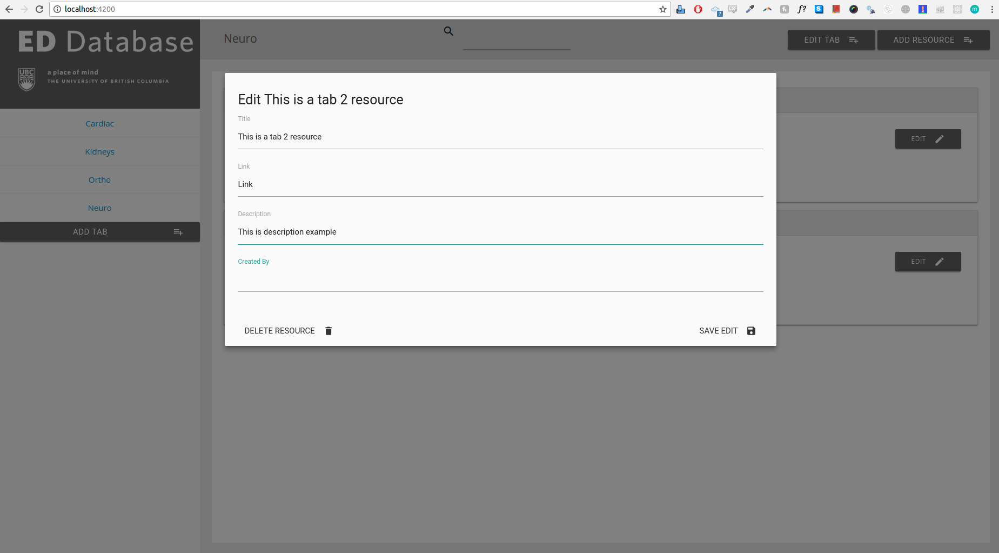

# Emergency Department Database

EDDB - This Angular2 Application is made to be a bookmark database of important links (resources) for the Emergency Department at BC Children's Hospital. Using Angular2, and FireBase for the backend.

# Start up

Clone or fork the repo, run 'npm install' to download all dependencies and then run 'npm start' to spin up a server using webpack. This project was created with the help of the angular-cli. 

# Screen Caps

